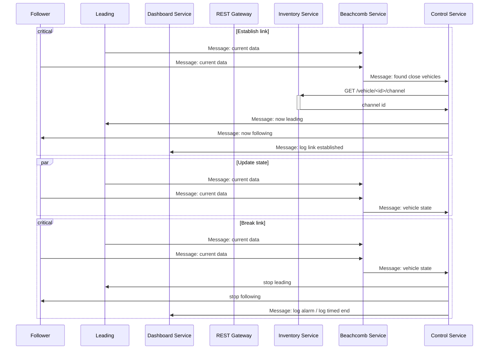
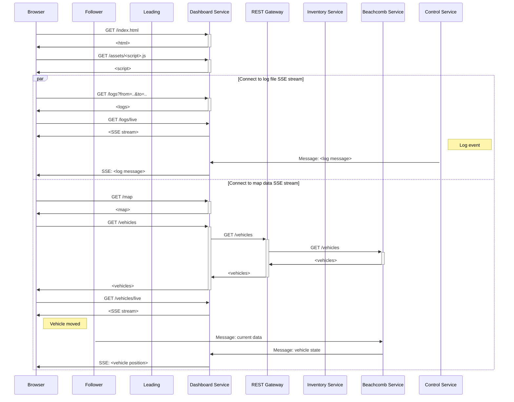

# DSE24

## Sequence charts

### Establish/Break link

### Register vehicle

### Connect dashboard to SSE streams

## Tech Stack

- Message Broker: RabbitMQ

- Containerization:
 - Docker + Kubernetes(GKE)
 - Google Cloud mit Github verknüpfen

- Webserver/REST: NodeJS

- DB: MongoDB (with geospatial queries)

