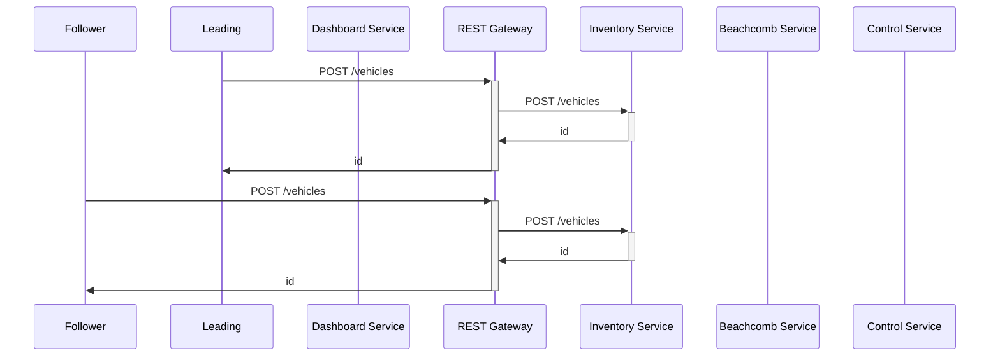
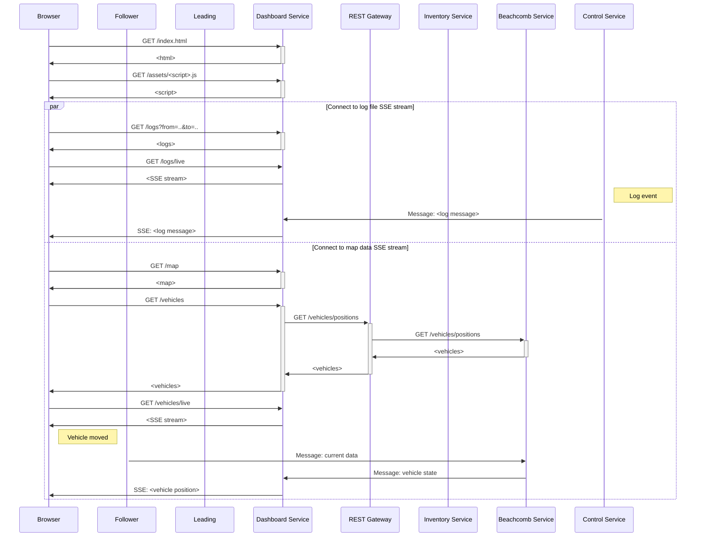
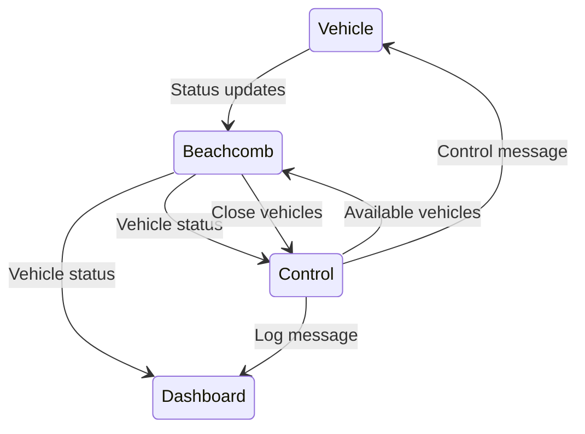

# DSE24

## Sequence charts

### Establish/Break link


### Register vehicle



### Connect dashboard to SSE streams


## Endpoints

### Gateway
#### POST `/vehicles` proxy
Calls to inventory service POST `/vehicles`.
For parameter descriptions see the [inventory service](#post-vehicles).

#### GET `/vehicles/positions` proxy
Calls to beachcomb service GET `/vehicles`.
For parameter descriptions see the [beachcomb service](#get-vehiclespositions).


### Inventory Service
#### POST `/vehicles`
Creates a new vehicle in the database and makes a new unique channel id.

The JSON body of a new vehicle contains:
```json
{
  "name": "...",
  "VIN": "...",
  "OEM": "...",
  "model_type": "...",
  "kind": "leading"
}
```

- The `VIN` (vehicle identification number) field is a 17 character string uniquely identifying the vehicle.
- The `kind` field describes whether the vehicle is leading or following and can be either `leading` or `following`.

#### GET `/vehicles/<id>/channel`
Gets the channel id for a vehicle by its id.

The JSON response:
```json
{
  "channel_id": "..."
}
```

### Beachcomb Service
#### GET `/vehicles/positions`
Gets the current positions of all vehicles.

The JSON response:
```json
[
  {
    "VIN": "...",
    "location": {
      "long": 123,
      "lat": 123,
      "heading": 123
    },
    "speed": 123,
    "lane": 1
  },
  {},
  {}
]
```

### Control Service


### Dashboard
#### GET `/` & GET `/assets`
Returns web resources needed for the dashboard frontend.

#### GET `/logs?from=..&to=..`
Gets the old log entries in the timespan from `from` to `to`.

The JSON response is an array of log messages, see [log messages](#log-messages) below.

#### GET `/logs/live`
Gets a server sent event (SSE) stream for incoming new log messages.

The JSON body of a log message event is the same as the entries of the GET endpoint.

#### GET `/map`
Gets the map. (TODO: Depends on the concrete implementation of the map.)

#### GET `/vehicles`
Gets the current positions of all active vehicles.
Calls to beachcomb service GET `/vehicles/positions` via the REST gateway.
For parameter descriptions see the [beachcomb service](#get-vehiclespositions).

#### GET `/vehicles/live`
Gets a server sent event (SSE) stream for incoming new vehicle positions.

The JSON body of a vehicle update message event is the same as the entries of the GET endpoint.


## Message Channels



### Vehicle status updates
Vehicles send their current status to this channel. The beachcomb service consumes these
messages, verifies/validates them, and processes them.

The JSON body of a status update of a vehicle:
```json
{
  "time": "...",
  "VIN": "...",
  "location": {
    "long": 123,
    "lat": 123,
    "heading": 123,
  },
  "speed": 123,
  "lane": 1,
  "follow_me": {
    "speed": 123,
    "lane": 123
  }
}
```

- The `VIN` (vehicle identification number) field is a 17 character string uniquely identifying the vehicle. 
- The `lane` field is a value between 1 and 3, where 1 is the right most lane on a street/road.
- The `follow_me` field data is only set/present if the vehicle is currently in the follow-me mode.
  - For a leading (autonomous) vehicle speed and lane fields are sent.
  - For a following (not autonomous) vehicle a boolean is set to `true`.

### Vehicle control message
In follow-me mode both participants (leading and following) get sent control messages to their respective
direct exchange channel by the control service.

The JSON body of a control message to a leading vehicle:
```json
{
  "time": "...",
  "follow_me": {
    "VIN": "..."
  }
}
```

- The `follow_me` field is only populated when the leading vehicle is in follow-me mode and has an active follower.
- The `follow_me.VIN` field is the VIN of the following vehicle.

The JSON body of a control message to a following vehicle:
```json
{
  "time": "...",
  "follow_me": {
    "VIN": "...",
    "speed": 123,
    "lane": 1
  }
}
```

- The `follow_me` field is only populated when the following vehicle is in follow-me mode and has an active leading vehicle.
- The `follow_me.VIN` field is the VIN of the leading vehicle.
- The `follow_me.speed` and `follow_me.lane` fields are the current driving target.

### Close vehicles
The beachcomb service monitors the active vehicles and detects when two vehicles come close to each other. It then sends
a message if the two vehicles are compatible and available to the channel. The control service consumes these messages
and tries to establish a follow-me link.

The JSON body of a close vehicles message:
```json 
{
  "VIN_follower": "...",
  "VIN_leading": "...",
}
```

### Available vehicles
The control service sends messages which vehicles are available for paring. The service only sends updates
when the availability of vehicles change. The messages are consumed by the beachcomb service, which has to
check which available vehicles are close.

The JSON body of a available vehicles message:
```json
{
  "available": ["...", "..."],
  "unavailable": ["...", "..."]
}
```

- The `available` field is an array of VINs that are now available.
- The `unavailable` field is an array of VINs that are now unavailable.

### Vehicle status
The beachcomb service regularly broadcasts the position updates of vehicles. The control service and dashboard consume
these messages.

The JSON message body has the same shape as the data returned from the REST [GET endpoint](#get-vehiclespositions) of the
beachcomb service.


### Log messages
The control service send its log messages to the log channel, where they get consumed by the dashboard.

The basic JSON body of every log message:
```json
{
  "time": "...",
  "severity": "info",
  "message": "...",
  "type", "follow_me_start",
  "data": {}
}
```

- The `severity` field is either `info`, `warning` or `alarm`
- The `message` field is a human readable textual representation of the message.
- The `type` field is the type of log message.
- The `data` field is machine readable representation of the message, that contains the important data.

The following `data` fields are defined for specific log messages.
- `vehicle_registered`: `VIN`, `name`
- `follow_me_start`: `VIN_follower`, `VIN_leader`
- `follow_me_end`: `VIN_follower`, `VIN_leader`
- `follow_me_tolerance_error`: `VIN_follower`, `VIN_leader`, `deviation_type`, `deviation_value`
  

## Tech Stack

- Message Broker: RabbitMQ

- Containerization:
 - Docker + Kubernetes(GKE)
 - Google Cloud mit Github verknüpfen

- Webserver/REST: NodeJS

- DB: MongoDB (with geospatial queries)

